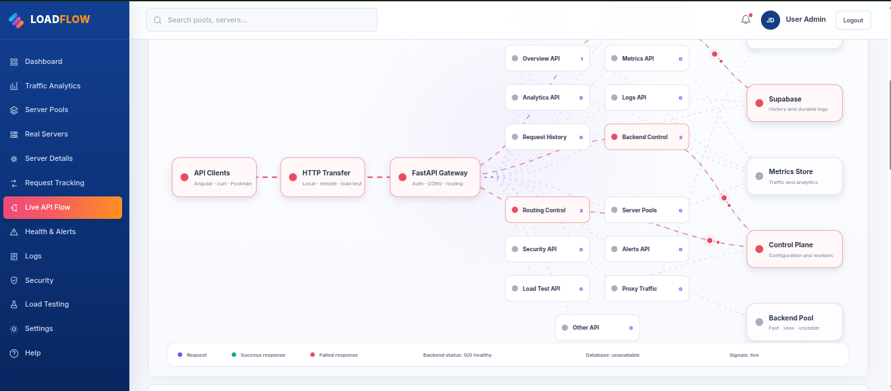
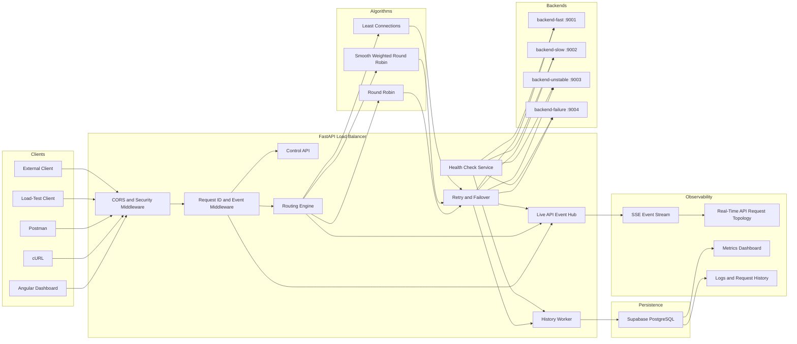

# LoadFlow Balancer


**LoadFlow** is a Docker-based load-balancing and observability platform built with FastAPI, Angular, Supabase PostgreSQL, and multiple simulated backend services.

It demonstrates how API traffic is distributed across healthy backend instances, how retries and failover are handled, how routing decisions are persisted, and how the complete request lifecycle can be visualized in real time.

---

## Project Overview

LoadFlow contains:

- A FastAPI load-balancer gateway
- An Angular monitoring dashboard
- Multiple simulated backend services
- Health-aware request routing
- Retry and failover handling
- Supabase PostgreSQL persistence
- Runtime algorithm switching
- Server-Sent Events for live request telemetry
- A Real-Time API Request Topology
- Docker Compose orchestration

The simulated backends represent different runtime conditions:

| Service | Purpose |
|---|---|
| `backend-fast` | Stable, low-latency backend |
| `backend-slow` | Intentionally delayed backend |
| `backend-unstable` | Intermittently failing backend |
| `backend-failure` | Controlled failure-testing backend |

---

## Implementation Phases

### Phase 1 — Load-Balancing Foundation

The first phase implemented the core routing platform.

- Round Robin request distribution
- Health-aware backend filtering
- Automatic exclusion of unhealthy backends
- Retry and failover handling
- Request latency and error tracking
- Concurrent API testing
- Docker-based service networking
- Angular monitoring dashboard
- Backend health checks

### Phase 2 — Persistence and Real-Time Observability

The second phase added persistent telemetry and live request visualization.

- Supabase PostgreSQL integration
- API request history
- Backend-selection history
- Request-attempt and retry records
- Response status and latency persistence
- Backend health-check history
- System and security events
- Load-test result storage
- Routing-configuration persistence
- Server-Sent Events lifecycle stream
- Real-Time API Request Topology

### Phase 3 — Smooth Weighted Round Robin

The third phase added capacity-based weighted routing.

- Smooth Weighted Round Robin
- Per-backend routing weights
- Smooth traffic distribution
- Runtime algorithm switching
- Weighted routing telemetry
- Supabase-backed routing configuration

### Phase 4 — Least Connections

The fourth phase added dynamic workload-aware routing.

The internal algorithm identifier is:

```text
least_inflight
```

The user-facing name is:

```text
Least Connections
```

The algorithm selects the backend with the lowest capacity-normalized active load:

```text
normalized_load = active_requests / weight
```

Implemented capabilities:

- Active-request-aware backend selection
- Capacity-normalized load calculation
- Rotating tie-break handling
- Atomic backend reservation
- Streaming-response-aware release
- Retry-safe backend exclusion
- Concurrent workload validation

---

## Load-Balancing Algorithms

| Algorithm | Internal name | Selection method | Recommended use |
|---|---|---|---|
| Round Robin | `round_robin` | Selects the next healthy backend in sequence | Backends with similar capacity |
| Smooth Weighted Round Robin | `smooth_weighted_round_robin` | Distributes traffic according to configured weights | Backends with known capacity differences |
| Least Connections | `least_inflight` | Selects the backend with the lowest normalized active load | Variable request duration and concurrent workloads |

---

## Real-Time API Request Topology

The feature previously described as a neural-network visualization is more accurately named:

> **Real-Time API Request Topology**

It is a live request-flow observability graph, not a machine-learning neural network.

It visualizes the API lifecycle:

```text
Client
→ FastAPI Gateway
→ Security and Request Middleware
→ Routing Engine
→ Selected Backend
→ Retry or Failover
→ Response
→ Supabase Persistence
```

It can observe requests originating from:

- Angular
- `curl`
- Postman
- Load-testing tools
- External API clients

Each request can expose:

- Request ID
- HTTP method and path
- Selected routing algorithm
- Selected backend
- Backend weight
- Active-request count
- Attempt number
- Retry and failover activity
- Response status
- End-to-end latency
- Supabase persistence state

The live event stream is implemented using Server-Sent Events.




---

## Architecture




---

## Quick Links

| Component | URL |
|---|---|
| Angular dashboard | http://localhost:4200 |
| Load balancer API | http://localhost:8080 |
| FastAPI documentation | http://localhost:8080/docs |
| Load balancer health check | http://localhost:8080/healthz |
| Real-Time API Request Topology | http://localhost:4200/api-flow |
| Control API overview | http://localhost:8080/api/control/overview |

---

## Project Structure

```text
load-balancer/
├── backend/
│   ├── app/
│   │   ├── api/
│   │   │   └── control.py
│   │   ├── core/
│   │   │   ├── config.py
│   │   │   └── security.py
│   │   ├── middleware/
│   │   │   └── api_event_middleware.py
│   │   ├── services/
│   │   │   ├── algorithms/
│   │   │   │   ├── round_robin.py
│   │   │   │   ├── smooth_weighted.py
│   │   │   │   └── least_inflight.py
│   │   │   ├── live_api_events.py
│   │   │   ├── proxy.py
│   │   │   ├── registry.py
│   │   │   └── router.py
│   │   ├── container.py
│   │   └── main.py
│   ├── tests/
│   ├── Dockerfile
│   ├── requirements.txt
│   └── pyproject.toml
├── frontend/
│   ├── public/
│   │   └── net.png
│   └── src/app/features/api-flow/
├── test-backends/
│   ├── app.py
│   ├── Dockerfile
│   └── requirements.txt
├── docs/
│   ├── interface.png
│   └── architecture.png
├── scripts/
├── docker-compose.yml
├── vercel.json
└── README.md
```

---

## Prerequisites

Install:

- Docker Engine
- Docker Compose v2
- Git
- `curl`
- Node.js and npm for local Angular development

Verify:

```bash
docker --version
docker compose version
git --version
curl --version
node --version
npm --version
```

Confirm Docker is working:

```bash
docker run --rm hello-world
```

---

## Clone and Open the Project

```bash
git clone <repository-url>
cd load-balancer
code .
```

Replace `<repository-url>` with the repository URL.

---

## Environment Configuration

Create or update:

```text
backend/.env
```

Example:

```env
ADMIN_API_KEY=replace-with-a-secure-admin-key

ALGORITHM=round_robin

ALLOWED_BACKEND_HOSTS=backend-fast,backend-slow,backend-unstable,backend-failure

SEED_BACKENDS_JSON=[{"id":"fast","name":"Fast API","url":"http://backend-fast:9001","weight":5},{"id":"slow","name":"Slow API","url":"http://backend-slow:9002","weight":2},{"id":"unstable","name":"Unstable API","url":"http://backend-unstable:9003","weight":1},{"id":"failure","name":"Failure API","url":"http://backend-failure:9004","weight":1}]

DATABASE_URL=postgresql+asyncpg://<user>:<password>@<host>:5432/<database>

LIVE_API_EVENTS_ENABLED=true
LIVE_API_EVENT_HISTORY_SIZE=10000
LIVE_API_SUBSCRIBER_QUEUE_SIZE=10000
LIVE_API_KEEPALIVE_SECONDS=15

EXPOSE_SELECTED_BACKEND_HEADER=true
```

Keep `SEED_BACKENDS_JSON` on one complete line.

Do not commit production credentials or Supabase secrets to Git.

---

## Verify Docker Compose

```bash
docker compose config
docker compose config --services
```

Expected services:

```text
backend-fast
backend-slow
backend-unstable
backend-failure
load-balancer
dashboard
```

---

## Build and Start

Build the complete system:

```bash
docker compose build
```

Build only the API stack:

```bash
docker compose build \
  backend-fast \
  backend-slow \
  backend-unstable \
  backend-failure \
  load-balancer
```

Force a clean load-balancer rebuild after backend changes:

```bash
docker compose build --no-cache load-balancer
```

Start the complete stack:

```bash
docker compose up -d --build
```

Check status:

```bash
docker compose ps
```

Follow load-balancer logs:

```bash
docker compose logs -f load-balancer
```

---

## Run the Angular Frontend Locally

```bash
cd frontend
npm ci
npm start
```

Open:

```text
http://localhost:4200
```

---

## Test the API

Health check:

```bash
curl http://localhost:8080/healthz
```

Send one request:

```bash
curl -i http://localhost:8080/api/demo
```

Send ten requests:

```bash
for i in $(seq 1 10); do
  curl -s -w "\nHTTP %{http_code}\n" \
    http://localhost:8080/api/demo
done
```

---

## Switch the Routing Algorithm

Load the backend environment:

```bash
cd ~/projects/load-balancer
set -a
source backend/.env
set +a
```

### Round Robin

```bash
curl -X PUT \
  "http://localhost:8080/api/control/routing" \
  -H "Content-Type: application/json" \
  -H "X-Admin-API-Key: $ADMIN_API_KEY" \
  -d '{"algorithm":"round_robin"}'
```

### Smooth Weighted Round Robin

```bash
curl -X PUT \
  "http://localhost:8080/api/control/routing" \
  -H "Content-Type: application/json" \
  -H "X-Admin-API-Key: $ADMIN_API_KEY" \
  -d '{"algorithm":"smooth_weighted_round_robin"}'
```

### Least Connections

```bash
curl -X PUT \
  "http://localhost:8080/api/control/routing" \
  -H "Content-Type: application/json" \
  -H "X-Admin-API-Key: $ADMIN_API_KEY" \
  -d '{"algorithm":"least_inflight"}'
```

Verify:

```bash
curl \
  -H "X-Admin-API-Key: $ADMIN_API_KEY" \
  "http://localhost:8080/api/control/routing"
```

---

## Configure Backend Weights

```bash
curl -X PATCH \
  "http://localhost:8080/api/control/backends/fast" \
  -H "Content-Type: application/json" \
  -H "X-Admin-API-Key: $ADMIN_API_KEY" \
  -d '{"weight":5}'
```

```bash
curl -X PATCH \
  "http://localhost:8080/api/control/backends/slow" \
  -H "Content-Type: application/json" \
  -H "X-Admin-API-Key: $ADMIN_API_KEY" \
  -d '{"weight":2}'
```

```bash
curl -X PATCH \
  "http://localhost:8080/api/control/backends/unstable" \
  -H "Content-Type: application/json" \
  -H "X-Admin-API-Key: $ADMIN_API_KEY" \
  -d '{"weight":1}'
```

---

## Generate Test Traffic

Sequential traffic:

```bash
time for i in $(seq 1 1000); do
  curl -s http://localhost:8080/api/demo > /dev/null
done
```

Concurrent traffic:

```bash
time seq 1 1000 | xargs -n1 -P50 \
  curl -s -o /dev/null \
  http://localhost:8080/api/demo
```

Sequential traffic is suitable for validating Round Robin and Smooth Weighted Round Robin.

Concurrent traffic is required to validate Least Connections correctly.

Count response codes:

```bash
seq 1 1000 | xargs -n1 -P50 \
  curl -s -o /dev/null -w "%{http_code}\n" \
  http://localhost:8080/api/demo \
  | sort | uniq -c
```

---

## Test the Live API Event Stream

Load the admin key:

```bash
set -a
source backend/.env
set +a
```

Test recent events:

```bash
curl -i \
  -H "X-Admin-API-Key: $ADMIN_API_KEY" \
  "http://localhost:8080/api/control/events/recent?limit=5"
```

Test the SSE stream:

```bash
timeout 10 curl -i -N \
  -H "X-Admin-API-Key: $ADMIN_API_KEY" \
  "http://localhost:8080/api/control/events/stream?recent=5"
```

Expected response:

```text
HTTP/1.1 200 OK
content-type: text/event-stream
```

Typical lifecycle events:

```text
request_received
backend_selected
attempt_started
attempt_completed
request_completed
history_saved
```

---

## Supabase Persistence

LoadFlow persists:

- Request history
- Request attempts
- Selected backends
- Retry activity
- Response status
- Latency measurements
- Backend health history
- Routing configuration
- Security events
- Load-test results

Database persistence runs outside the main routing path so telemetry failures do not block request forwarding.

---

## Troubleshooting

### Backend changes are not visible inside Docker

Recreating a container does not always rebuild its image.

```bash
cd ~/projects/load-balancer

docker compose build --no-cache load-balancer
docker compose up -d --force-recreate load-balancer
```

### Live stream is forwarded to a simulated backend

The control router must be registered before the catch-all proxy router:

```python
app.include_router(control_router)
app.include_router(proxy_router)
```

The endpoint below must be handled by the load-balancer application itself:

```text
/api/control/events/stream
```

It must not be forwarded to a simulated backend.

### Verify live-event support inside Docker

```bash
docker compose exec -T load-balancer python - <<'PY'
from app.main import app

container = getattr(app.state, "container", None)
settings = getattr(container, "settings", None)

print(
    "Has live_api_events:",
    hasattr(container, "live_api_events") if container else False,
)

print(
    "Has live_api_keepalive_seconds:",
    hasattr(settings, "live_api_keepalive_seconds")
    if settings else False,
)
PY
```

Both values should be `True`.

### View service logs

```bash
docker compose logs --tail=100 \
  backend-fast \
  backend-slow \
  backend-unstable \
  backend-failure \
  load-balancer
```

---

## Development Workflow

After changing load-balancer backend code:

```bash
docker compose build --no-cache load-balancer
docker compose up -d --force-recreate load-balancer
docker compose logs -f load-balancer
```

After changing simulated backends:

```bash
docker compose up -d --build \
  backend-fast \
  backend-slow \
  backend-unstable \
  backend-failure
```

After changing Angular frontend code:

```bash
cd frontend
npm start
```

---

## Engineering Notes

- Docker service names are also internal DNS hostnames.
- Internal backend ports do not need to be exposed to the host.
- Health endpoints should remain independent from simulated application failures.
- Backend selection and active-request increment must be atomic for Least Connections.
- Streaming responses must release backend reservations only after the response body completes.
- Frontend interceptors only observe browser-originated requests.
- Complete API visibility must be instrumented at the FastAPI gateway.
- Telemetry persistence should not block the main request path.
- High-volume visualizations require bounded queues and event sampling.
- Keep Docker Compose, environment variables, Supabase constraints, and algorithm identifiers synchronized.

---

## Roadmap

- Least Response Time
- Circuit breaker support
- Redis-backed shared routing state
- Rate limiting
- Prometheus metrics
- Grafana dashboards
- Distributed tracing
- Dynamic backend registration
- Multiple load-balancer replicas
- Production deployment automation

---

## Author

**Sachin Ramasamy**  
Full-Stack Developer

- Portfolio: https://sachinrtech.vercel.app/
- Live Demo: https://loadbalancer-chi.vercel.app/dashboard
- GitHub: https://github.com/SachinRamasamy-cloud/loadbalancer
