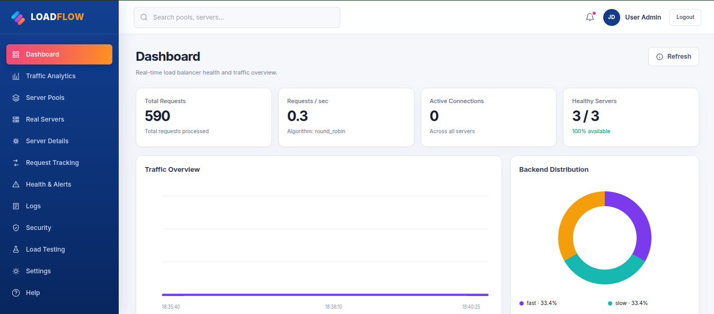
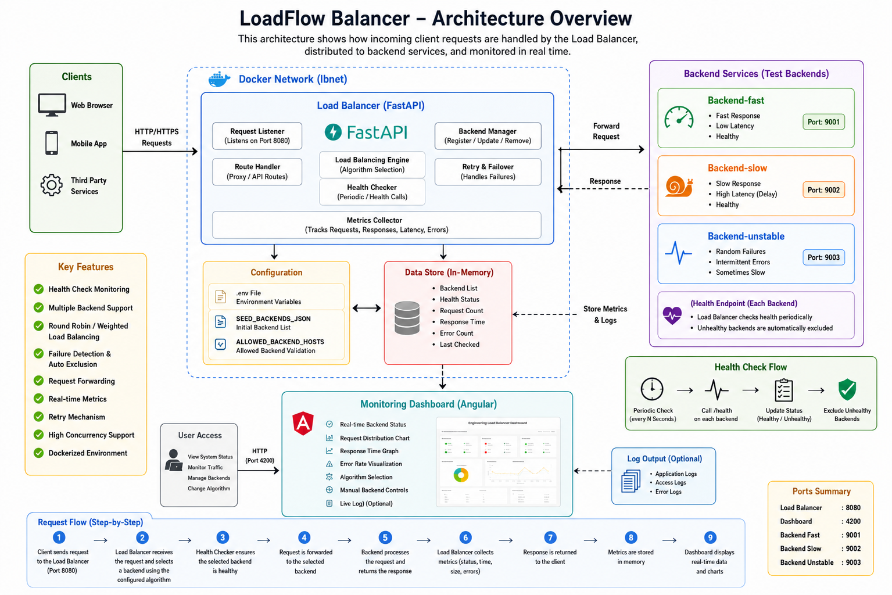
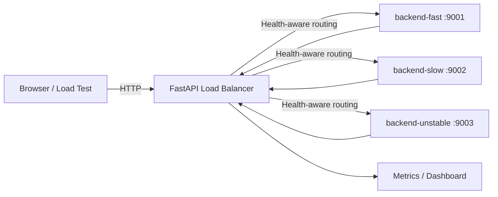

# LoadFlow Balancer



A Docker-based local development project that demonstrates health-aware request distribution across multiple FastAPI backend services.


## Project Description

Engineering Load Balancer is a Docker-based demonstration project that shows how incoming HTTP requests can be distributed across multiple backend services.

The project contains a FastAPI load balancer, an Angular monitoring dashboard, and several simulated backend services with different response characteristics. These backend services are used to demonstrate how a load balancer behaves when some servers are fast, slow, unstable, or unavailable.

The load balancer receives client requests, selects an appropriate healthy backend, forwards the request, and returns the backend response to the client. It also tracks backend health, response time, request count, failures, and routing behavior.

This project is designed for learning and testing important load-balancing concepts such as:

- Round-robin request distribution
- Weighted backend selection
- Health checks
- Failure handling
- Retry behavior
- Backend monitoring
- Concurrent request handling
- Docker service networking
- Real-time performance visualization

The complete system runs locally using Docker Compose. Each backend runs as an independent container and communicates with the load balancer through a private Docker network.

The Angular dashboard provides a visual interface for monitoring traffic distribution, backend availability, response time, error rate, and the currently selected load-balancing algorithm.




## Quick links

| Component | URL |
|---|---|
| Angular dashboard | http://localhost:4200 |
| Load balancer API | http://localhost:8080 |
| FastAPI documentation | http://localhost:8080/docs |
| Load balancer health check | http://localhost:8080/healthz |

> The current branch defines `backend-fast`, `backend-slow`, and `backend-unstable`. It does not define `backend-failure`.

## How it works



The client sends requests to port `8080`. The load balancer selects an available backend, forwards the request, and records health and performance information. The Angular dashboard is exposed on port `4200`.

## Project structure

```text
load-balancer/
├── backend/                 # Main FastAPI load balancer
│   ├── app/
│   ├── tests/
│   ├── Dockerfile
│   ├── requirements.txt
│   └── pyproject.toml
├── frontend/                # Angular dashboard
├── test-backends/           # Simulated destination services
│   ├── app.py
│   ├── Dockerfile
│   └── requirements.txt
├── docs/
├── scripts/
├── docker-compose.yml
├── .env
└── README.md
```

## Prerequisites

Install:

- Docker Engine
- Docker Compose v2
- Git
- `curl`

Verify:

```bash
docker --version
docker compose version
git --version
curl --version
```

Confirm Docker is working:

```bash
docker run --rm hello-world
```

## Clone and open the project

```bash
git clone <repository-url>
cd load-balancer
code .
```

Replace `<repository-url>` with the Git URL of the project.

## Environment configuration

Create the local environment file:

```bash
cp .env.example .env
```

For the current branch:

```env
ALLOWED_BACKEND_HOSTS=backend-fast,backend-slow,backend-unstable
```

Example backend seed configuration:

```env
SEED_BACKENDS_JSON=[{"id":"fast","name":"Fast API","url":"http://backend-fast:9001","weight":3},{"id":"slow","name":"Slow API","url":"http://backend-slow:9002","weight":1},{"id":"unstable","name":"Unstable API","url":"http://backend-unstable:9003","weight":1}]
```

Keep `SEED_BACKENDS_JSON` on one complete line inside `.env`. Do not paste incomplete JSON directly into the terminal.

## Verify the Compose configuration

```bash
docker compose config
docker compose config --services
```

Expected services:

```text
backend-fast
backend-slow
backend-unstable
load-balancer
dashboard
```

## Build the project

Build everything:

```bash
docker compose build
```

Build only the API stack:

```bash
docker compose build \
  backend-fast \
  backend-slow \
  backend-unstable \
  load-balancer
```

## Start the project

Start the complete stack:

```bash
docker compose up -d --build
```

Start only the API stack:

```bash
docker compose up -d --build \
  backend-fast \
  backend-slow \
  backend-unstable \
  load-balancer
```

Check service status:

```bash
docker compose ps
```

Follow all logs:

```bash
docker compose logs -f
```

Follow only load-balancer logs:

```bash
docker compose logs -f load-balancer
```

Press `Ctrl+C` to exit the log viewer. The containers continue running.

## Docker startup screenshot


## Test the API

Health check:

```bash
curl http://localhost:8080/healthz
```

Open the interactive API documentation:

```text
http://localhost:8080/docs
```

Send one test request:

```bash
curl -i http://localhost:8080/api/demo
```

Send 10 requests:

```bash
for i in {1..10}; do
  curl -s -w "\nHTTP %{http_code}\n" \
    http://localhost:8080/api/demo
done
```

## Generate 1,000 requests

Sequential test:

```bash
time for i in $(seq 1 1000); do
  curl -s http://localhost:8080/api/demo > /dev/null
done
```

Concurrent test with 50 workers:

```bash
time seq 1 1000 | xargs -n1 -P50 \
  curl -s -o /dev/null \
  http://localhost:8080/api/demo
```

Count HTTP status codes:

```bash
seq 1 1000 | xargs -n1 -P50 \
  curl -s -o /dev/null -w "%{http_code}\n" \
  http://localhost:8080/api/demo \
  | sort | uniq -c
```

Example result:

```text
950 200
50 500
```

This means 950 requests succeeded and 50 returned an error response.

## Stop and clean up

Stop the stack:

```bash
docker compose down
```

Remove orphaned containers:

```bash
docker compose down --remove-orphans
```

Remove containers and local volumes:

```bash
docker compose down --remove-orphans --volumes
```

## Troubleshooting

### `no such service: backend-failure`

The current branch does not define that service. Check available services:

```bash
docker compose config --services
```

Start only the services listed by that command.

### `failed to read dockerfile`

Confirm both Dockerfiles exist:

```bash
ls -l backend/Dockerfile
ls -l test-backends/Dockerfile
```

The main load balancer uses `backend/Dockerfile`. The simulated backend services use `test-backends/Dockerfile`.

### Stale Docker network or container

Changing branches can leave containers from an older Compose configuration.

```bash
docker compose down --remove-orphans || true

docker ps -aq \
  --filter "label=com.docker.compose.project=load-balancer" \
  | xargs -r docker rm -f

docker network rm load-balancer_lbnet 2>/dev/null || true
```

Recreate the current services:

```bash
docker compose up -d --force-recreate \
  backend-fast \
  backend-slow \
  backend-unstable \
  load-balancer
```

### Validate the simulated backend Python file

```bash
python3 -m py_compile test-backends/app.py
```

No output means the file passed the syntax check.

### View service logs

```bash
docker compose logs --tail=100 \
  backend-fast \
  backend-slow \
  backend-unstable \
  load-balancer
```

## Development workflow

After changing backend code:

```bash
docker compose up -d --build load-balancer
docker compose logs -f load-balancer
```

After changing the simulated backends:

```bash
docker compose up -d --build \
  backend-fast \
  backend-slow \
  backend-unstable
```

After changing the Angular frontend:

```bash
docker compose up -d --build dashboard
```

## Notes

- Docker service names are also internal DNS hostnames.
- Internal backend ports do not need to be exposed to the host unless direct host access is required.
- The health endpoint should remain independent from simulated application failures.
- Keep branch-specific `docker-compose.yml` and `.env` values synchronized.
