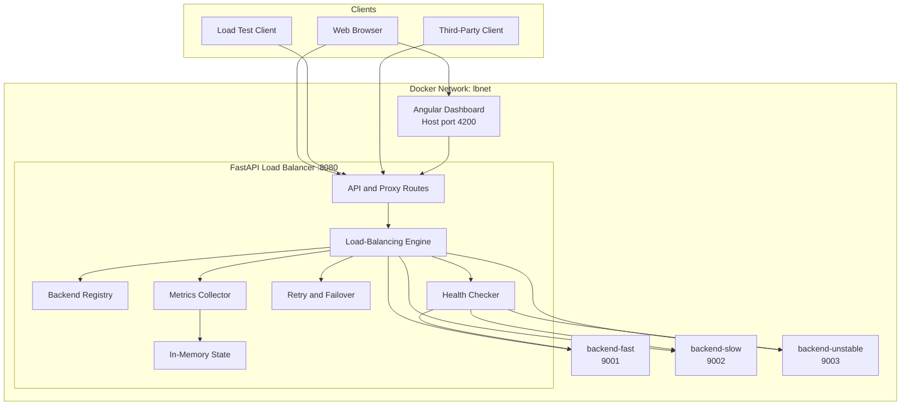

# Architecture Overview

## Architectural characteristics

- Containerized local deployment
- HTTP reverse-proxy behavior
- Health-aware backend selection
- Configurable routing algorithm
- Runtime metrics collection
- Simulated latency and failures
- Angular operational dashboard
