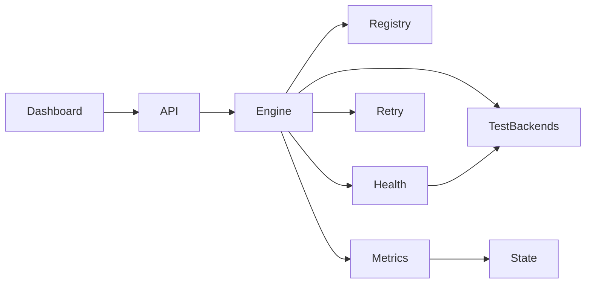

# Component Diagram

| Component | Responsibility |
|---|---|
| Angular Dashboard | Visual monitoring and supported controls |
| FastAPI API Layer | HTTP entry point and control endpoints |
| Routing Engine | Backend selection |
| Backend Registry | Backend metadata and status |
| Health Checker | Availability probes |
| Retry and Failover | Alternative backend selection |
| Metrics Collector | Request and latency accounting |
| In-Memory State | Runtime backend and metric state |
| Test Backends | Simulated service behavior |

