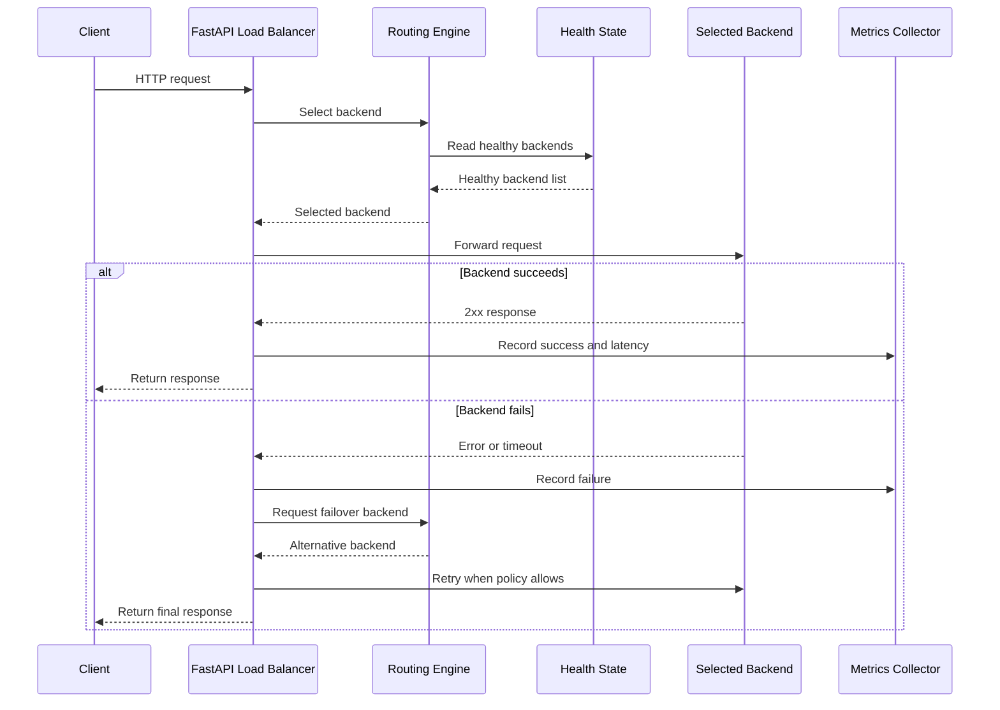

# Request Flow

## Steps

1. Client calls port `8080`.
2. FastAPI validates the request.
3. The routing engine reads healthy backends.
4. The active algorithm selects one backend.
5. The request is forwarded.
6. Status and latency are recorded.
7. The response is returned.
8. The dashboard reads aggregated state.
