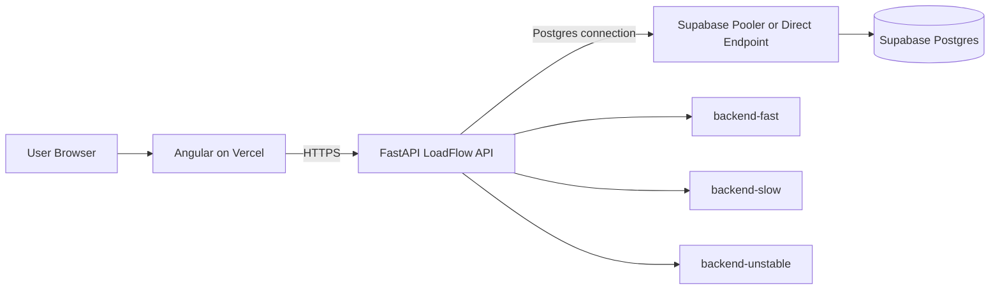

# 3. Supabase Connection Strategy

## Recommended architecture



## Primary rule

Only the FastAPI backend should hold database credentials.

The Angular application should call FastAPI. It should not receive the Postgres password, migration credentials, or a Supabase secret/service-role key.

## Connection modes

### Direct connection

Use when FastAPI runs as a persistent VM or long-running container and the deployment environment can reach the direct Supabase endpoint.

Best suited to:

- Long-lived application servers
- Migrations
- Database administration
- Backup and restore operations

### Supavisor session mode

Use when FastAPI is persistent but direct connectivity is unavailable or an IPv4-compatible pooled endpoint is required.

Typical port:

```text
5432
```

### Supavisor transaction mode

Use for serverless, edge, or highly elastic deployments with many short-lived clients.

Typical port:

```text
6543
```

Important limitation:

- Transaction mode does not support prepared statements.
- The PostgreSQL driver must disable prepared-statement caching.

## Recommended decision for LoadFlow

For one persistent FastAPI container:

1. Prefer a direct connection when reachable.
2. Otherwise use Supavisor session mode.
3. Keep the application-side pool small.

For future autoscaling:

1. Use transaction mode.
2. Disable prepared statements.
3. Start with a very small local pool.
4. Increase only after measurement.

## Separate runtime and migration URLs

Use:

```text
DATABASE_URL_RUNTIME
DATABASE_URL_MIGRATION
```

Runtime:

- Direct or session pooler for persistent containers
- Transaction pooler for serverless or highly elastic deployments

Migrations:

- Direct or session pooler
- Never transaction pooling

## Driver stack

Recommended:

- SQLAlchemy 2.x
- Async SQLAlchemy engine
- asyncpg
- Alembic

Create the engine once per process, not once per request.
